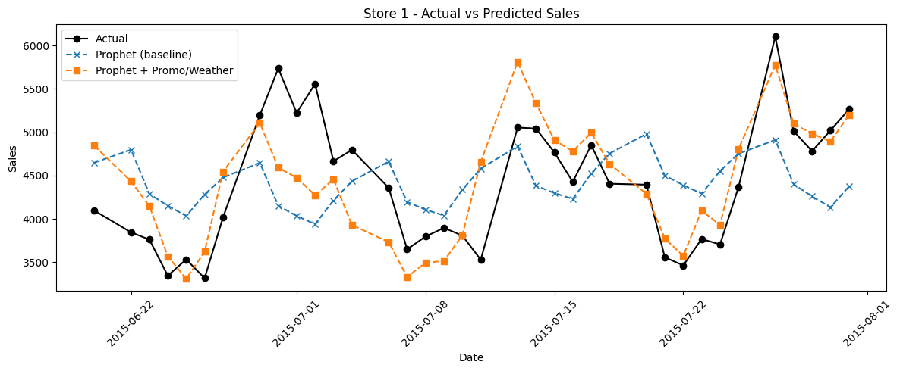
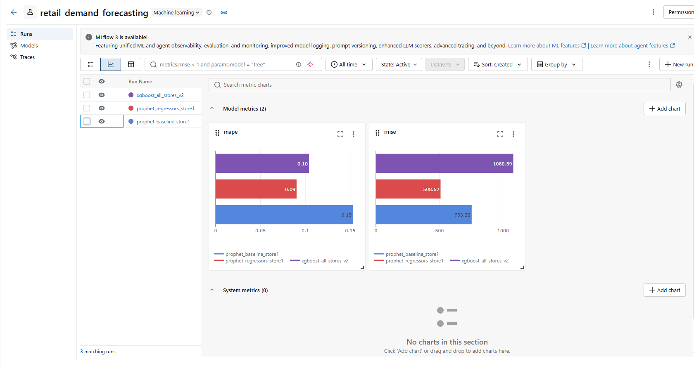
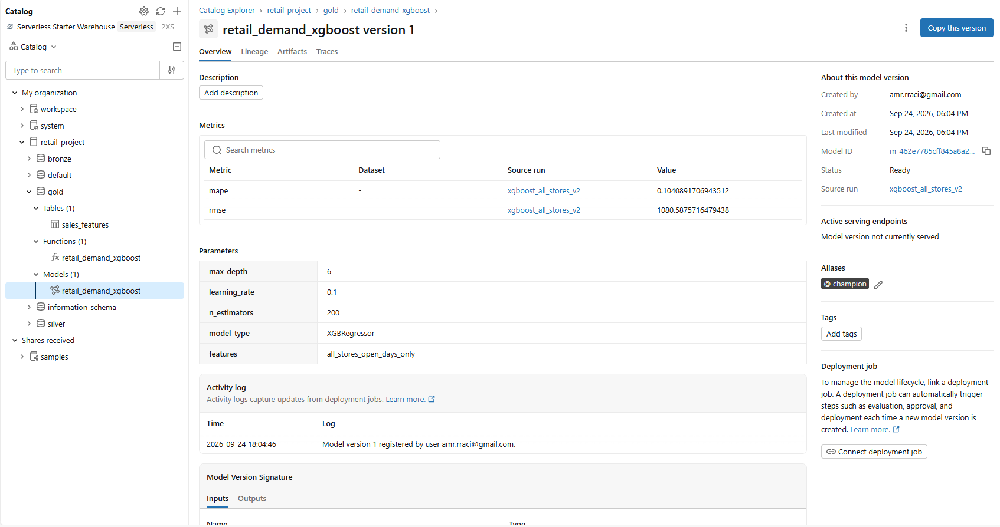
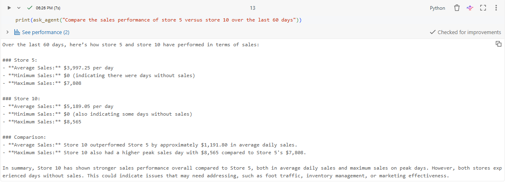
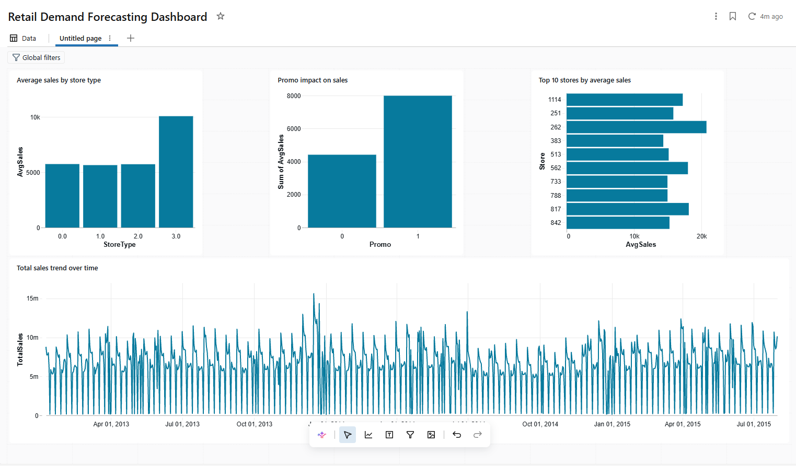

# Retail Demand Forecasting & GenAI Analytics Assistant

An end-to-end lakehouse pipeline built on **Databricks Free Edition** that ingests multi-source retail data, forecasts demand using multiple modeling approaches, tracks experiments with MLflow, and lets users ask natural language questions about sales performance via a GenAI agent.

Built as a demonstration project covering data engineering, forecasting, machine learning, MLOps, and generative AI integration on the Databricks Lakehouse Platform

---

## Project Overview

This project simulates a real-world retail analytics use case: predicting daily store sales using historical sales data, store metadata, and external weather data, then surfacing those insights through both a visual dashboard and a conversational AI agent.

**Data sources:**
- **Rossmann Store Sales** dataset (1,115 stores, ~2.5 years of daily sales history)
- **Open-Meteo Historical Weather API** (temperature and precipitation, Berlin as a Germany-wide proxy)

**Architecture:** Bronze → Silver → Gold lakehouse pattern using Delta Lake, with forecasting models (Prophet, XGBoost) trained on the Gold layer, tracked via MLflow, and registered in Unity Catalog's Model Registry.

---

## Architecture

```
Raw Sources (CSV + Weather API)
        │
        ▼
   BRONZE LAYER          (retail_project.bronze)
   sales_raw, store_raw, weather_raw
        │
        ▼
   SILVER LAYER          (retail_project.silver)
   Cleaned, joined sales + store + weather data
        │
        ▼
   GOLD LAYER            (retail_project.gold)
   Model-ready features: lags, rolling averages, encoded categoricals
        │
        ├──────────────┬─────────────────┐
        ▼              ▼                 ▼
   Prophet Model   XGBoost Model    SQL Dashboard
   (per-store)     (all stores)     (Databricks SQL)
        │              │
        └──────┬───────┘
               ▼
          MLflow Tracking
               │
               ▼
      Unity Catalog Model Registry
               │
               ▼
        GenAI Agent (OpenAI function-calling)
        Natural language Q&A over forecasts and sales data
```

---

## Tech Stack

| Category | Tools |
|---|---|
| Compute & Storage | Databricks Free Edition (serverless), Delta Lake, Unity Catalog |
| Data Engineering | PySpark, Delta Lake, Databricks Volumes |
| Forecasting | Prophet, (ARIMA considered, Prophet selected after baseline comparison) |
| Machine Learning | XGBoost, scikit-learn |
| Experiment Tracking | MLflow (tracking + Model Registry) |
| GenAI | OpenAI API (`gpt-4o-mini`), function-calling / tool use |
| External Data | Open-Meteo Historical Weather API |
| Visualization | Databricks SQL Dashboards, Matplotlib |
| Version Control | Git, GitHub (via Databricks Git folders) |
| Secrets Management | Databricks Secret Scopes (`dbutils.secrets`) |

---

## Repository Structure

```
retail-demand-genai-forecast/
├── README.md
├── requirements.txt
├── .gitignore
├── .env.example                        # Template for local credentials (standalone app)
├── app.py                              # Streamlit chat UI (runs outside Databricks)
│
├── notebooks/
│   ├── 01_ingest_bronze.ipynb          # Raw ingestion: sales, store, weather
│   ├── 02_clean_silver.ipynb           # Cleaning, null handling, joins
│   ├── 03_feature_gold.ipynb           # Lags, rolling averages, encoding
│   ├── 04_forecast_prophet_arima.ipynb # Prophet forecasting + MLflow logging
│   ├── 05_ml_model.ipynb               # XGBoost model + Model Registry
│   └── 06_genai_agent.ipynb            # OpenAI function-calling agent (in-Databricks)
│
├── src/
│   └── agent.py                        # Standalone agent logic (used by app.py)
│
├── data/
│   └── sample/
│       ├── sample_sales.csv            # 15-row sample of raw sales data (Bronze schema)
│       └── sample_store.csv            # 15-row sample of raw store metadata (Bronze schema)
│
└── docs/
    └── images/
        ├── mlflow_comparison.png
        ├── mlflow_all_runs_comparison.png
        ├── model_registry_xgboost.png
        ├── prophet_actual_vs_predicted_store1.png
        ├── genai_agent_example.png
        └── sql_dashboard.png
```

---

## Pipeline Walkthrough

### 1. Bronze Layer — Raw Ingestion (`01_ingest_bronze.ipynb`)

Raw CSV files (uploaded to a Unity Catalog Volume) and historical weather data (fetched from Open-Meteo) are landed as-is into Delta tables — no transformations applied.

**Data quality findings:**
- `sales_raw`: 0 nulls across all 1,017,209 rows — fully clean.
- `store_raw`: 3 nulls in `CompetitionDistance`; 354 nulls each in `CompetitionOpenSinceMonth` / `CompetitionOpenSinceYear`.
- `weather_raw`: 942 daily records covering the full sales date range (2013-01-01 to 2015-07-31).

### 2. Silver Layer — Cleaning & Joining (`02_clean_silver.ipynb`)

- Standardized `StateHoliday` (`0`, `a`, `b`, `c`) into a binary `IsStateHoliday` flag while preserving the original category.
- Handled store metadata nulls:
  - `CompetitionDistance` nulls → filled with a large placeholder (999999), implying no meaningful nearby competition.
  - `CompetitionOpenSinceMonth/Year` nulls → filled with 0, flagged via `has_competition_open_date`.
  - `Promo2SinceWeek/Year`, `PromoInterval` nulls → expected when `Promo2 = 0` (store never opted into the program), filled with 0 / "None" as not-applicable placeholders.
- Joined sales + store metadata + historical weather (by `Date`) into a single Silver table: `retail_project.silver.sales_store_weather` (1,017,209 rows, zero nulls introduced by joins).

### 3. Gold Layer — Feature Engineering (`03_feature_gold.ipynb`)

- **Calendar features:** Year, Month, WeekOfYear.
- **Lag features:** `Sales_Lag1` (previous day), `Sales_Lag7` (same day last week).
- **Rolling feature:** `Sales_RollingAvg7` (trailing 7-day average, excludes current day to avoid data leakage).
- **Categorical encoding:** `StoreType`, `Assortment`, `StateHoliday` → numeric indices via `StringIndexer`.
- **Data leakage prevention:** `Customers` was dropped — it's only known *after* a sales day occurs and cannot be used to predict that same day's sales.
- 7,805 rows (first 7 days per store, ~7 × 1,115 stores) dropped due to incomplete lag/rolling history.

Final table: `retail_project.gold.sales_features` (1,009,404 rows).

---

## Forecasting Results

### Prophet (Store-Level)

Two models were trained and compared for Store 1, using a 6-week (42-day) holdout period, matching the original Rossmann Kaggle competition's forecast horizon. Closed days (`Open = 0`, e.g. Sundays) were excluded from training, since `Sales = 0` on these days is definitional rather than a genuine demand signal.

| Model | MAPE | RMSE |
|---|---|---|
| Prophet (sales history only) | 15.32% | 753.38 |
| Prophet + Promo/Weather regressors | **9.02%** | **508.62** |

Adding Promo, temperature, and precipitation as external regressors substantially reduced forecast error, confirming that external factors meaningfully influence sales patterns.



**Limitation:** this evaluation uses actual historical weather values for the test period. A production forecasting system would need a weather *forecast* API (not historical actuals) to predict genuinely future, unseen dates.

### XGBoost (All Stores)

Rather than training one model per store, XGBoost was trained once across all 1,115 stores simultaneously, using the same open-days-only approach.

| Model | Scope | MAPE | RMSE |
|---|---|---|---|
| XGBoost | All 1,115 stores | **10.41%** | 1080.59 |

**Note on comparing RMSE across models:** XGBoost's RMSE reflects predictions across all stores, including high-volume locations with naturally larger absolute sales figures (and thus larger absolute errors). MAPE is the fairer cross-model comparison since it's normalized by scale. Even so, the two models solve different problems — one generalized model for the whole business vs. many specialized per-store models — a real architectural trade-off rather than a simple "better/worse" comparison.

**Data quality note:** 54 rows were found where `Open = 1` but `Sales = 0` (a small, genuine data anomaly) — excluded from MAPE calculation to avoid division-by-zero distortion.

---

## Experiment Tracking & Model Registry

All three models (Prophet baseline, Prophet + regressors, XGBoost) were logged to **MLflow** with parameters, metrics, and model artifacts for full reproducibility and comparison.



The best-performing model was registered in **Unity Catalog's Model Registry** (`retail_project.gold.retail_demand_xgboost`) with a proper model signature, and tagged with a `champion` alias marking it as the production-designated version.



---

## GenAI Agent

`06_genai_agent.ipynb` implements an agentic workflow using OpenAI's function-calling API. The agent has access to tools that query real data from the Gold table, and autonomously decides which tool(s) to call based on the user's natural language question — rather than following any hardcoded logic mapping questions to specific queries.

**Tools available to the agent:**
- `get_historical_trend(store_id, days)` — recent sales statistics for a store
- `get_forecast_summary(store_id)` — forecasting model accuracy context

**Example interaction:**

> **Q:** "What's the recent sales trend for store 1, and how accurate is our forecasting model for it?"
>
> **A:** For Store 1, over the last 30 days, the average daily sales amount to approximately $3,868.10. Sales ranged from $0 to $6,102, reflecting some days with no sales (likely closures) alongside strong-performing days. Regarding our forecasting model, the typical error percentage is between 9-10% MAPE based on holdout evaluations. Factors like promotions and weather can impact sales accuracy.

The agent was also tested with multi-store comparison questions (correctly calling the same tool multiple times) and rephrased questions (producing consistent, grounded answers regardless of exact phrasing) — confirming answers are always sourced from real data rather than generated from the model's own assumptions.



### Standalone Version (No Databricks Account Needed to Test)

The same agent logic is also available as a standalone Streamlit app (`app.py`, backed by `src/agent.py`), so anyone can try it without a Databricks account of their own. Instead of `spark`/`dbutils` (only available inside Databricks notebooks), this version connects to the same Gold Delta table over the **Databricks SQL Connector**, using a SQL Warehouse endpoint and a personal access token stored in a local `.env` file.

**To run it locally:**
```bash
pip install -r requirements.txt
cp .env.example .env    # fill in your OpenAI key + Databricks SQL Warehouse credentials
streamlit run app.py
```

This opens a chat interface in the browser where you can ask the same natural-language questions demonstrated above, with full multi-turn conversation support.

---

## Dashboard

A Databricks SQL Dashboard visualizes key metrics from the Gold layer:



- **Average sales by store type** — Type "3" stores significantly outperform others.
- **Promo impact on sales** — promotional days show roughly double the average sales of non-promotional days.
- **Top 10 stores by average sales** — highlights highest-performing locations.
- **Total sales trend over time** — reveals weekly seasonality (Sunday closures) and periodic demand spikes tied to promotions/holidays.

---

## Key Engineering Decisions & Findings

- **Data leakage prevention:** `Customers` excluded from features (only known after the fact); rolling averages exclude the current day.
- **Closed-day handling:** Sundays and other closed days (`Open = 0`) excluded from model training across both Prophet and XGBoost, since `Sales = 0` on these days is definitional, not a genuine demand signal — this was discovered after an initial Prophet model produced impossible negative sales predictions.
- **Data anomalies documented, not hidden:** 54 rows with `Open = 1` but `Sales = 0` were identified and explicitly excluded from MAPE calculations rather than silently ignored.
- **Weather as a simplification:** exact per-store locations aren't available in the public Rossmann dataset, so a single representative location (Berlin) was used as a Germany-wide weather proxy — a documented, reasonable simplification given available data.
- **Architecture pattern discipline:** raw data ingestion (including the weather API fetch) was deliberately kept in the Bronze layer notebook, separate from Silver-layer cleaning/joining logic, maintaining a consistent Bronze/Silver/Gold separation throughout.

---

## Running This Project

1. Create a free **Databricks Free Edition** account.
2. Upload the Rossmann Store Sales CSVs (`train.csv`, `store.csv`) to a Unity Catalog Volume.
3. Store your OpenAI API key in a Databricks secret scope:
   ```bash
   databricks secrets create-scope my-project-secrets
   databricks secrets put-secret my-project-secrets openai-api-key
   ```
4. Run notebooks `01` through `06` in order (each writes to Delta tables consumed by the next).
5. View the MLflow experiment comparison under **Experiments**, and the registered model under **Catalog → retail_project → gold → Models**.
6. View the dashboard under **Dashboards → Retail Demand Forecasting Dashboard**.
7. *(Optional)* Test the agent outside Databricks: install `requirements.txt` locally, copy `.env.example` to `.env` with your credentials, and run `streamlit run app.py`.

---

## Sample Data

`data/sample/` contains small (15-row) samples of the raw Rossmann dataset,
exported directly from the Bronze layer tables, for schema reference:

- **`sample_sales.csv`** — sample of raw daily sales records (`sales_raw`)
- **`sample_store.csv`** — sample of raw store metadata (`store_raw`)

These reflect the data exactly as ingested, before any cleaning or feature
engineering. Full datasets are not committed to this repo due to size — see
[Kaggle's Rossmann Store Sales competition](https://www.kaggle.com/c/rossmann-store-sales)
or a public mirror to obtain the complete data.

---

## Future Improvements

- Add ARIMA as an additional forecasting baseline for comparison.
- Source future weather *forecasts* (not historical actuals) to enable genuinely future-looking predictions with the regressor-enhanced Prophet model.
- Deploy the GenAI agent behind a lightweight UI (e.g., Streamlit) for interactive, non-technical stakeholder use.
- Configure Databricks Workflows for scheduled, automated pipeline runs and model retraining.
- Extend the GenAI agent with additional tools (e.g., direct model inference calls to the registered XGBoost model via Model Serving).

---

## Author's Note

This project was built as a portfolio piece demonstrating an end-to-end data engineering, forecasting, MLOps, and GenAI workflow on Databricks — from raw multi-source data ingestion through to a natural-language analytics interface, following the Bronze/Silver/Gold lakehouse pattern throughout.